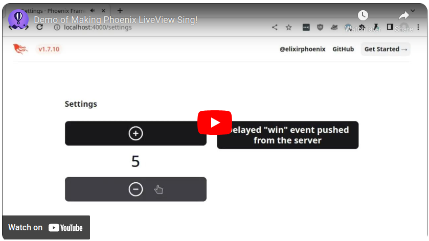

# Sing

A Phoenix LiveView demo application showing how to add sound effects to a LiveView page. Sound effects are linked to button clicks and played locally in the browser, while other sound effects can be triggered by the server.

The solution uses the [Howler.js](https://www.npmjs.com/package/howler) library in the browser, making it a mobile friendly solution as well.

Article that further explores this topic: [Making Phoenix LiveView Sing!](https://fly.io/phoenix-files/making-phoenix-liveview-sing/).

## Demo Video

Check out the demo video to see what it does. Make sure your sound is turned on!

## Steps to run

- Clone or download the project
- Download the needed JS package: `cd assets; npm i`
- `mix deps.get; mix compile`
- Run the project: `mix phx.server`
- Visit the [Settings page](http://localhost:4000/settings)

## Steps to duplicate

This process is covered in greater detail in the [Fly.io blog](https://fly.io/phoenix-files/) article [Making Phoenix LiveView Sing!](https://fly.io/phoenix-files/making-phoenix-liveview-sing/).

The following is a rough outline of the steps taken to add this approach to a project.

- add `assets/js/hooks/audio_mp3.js`
- updated `app.js` to load the hook file
- add Howler from npm
  - `cd assets; npm i howler` adds to `package.json`
- `mix esbuild.install`
- add HTML code for hook to page, output sounds in HTML `data-sounds`
- add `assign_sounds` to mount in LiveView
- add `priv/static/audio/` and some audio files.
- update `lib/sing_web.ex` to add `audio` to the list
- add sound related code in `index.ex`
- add sound related code in `index.html.heex`
- add delayed sound event pushed from server.

**Note:**

In a real application, could use Ecto schemas to validate user inputs and limits. This is trying to keep the demo as simple as possible.

